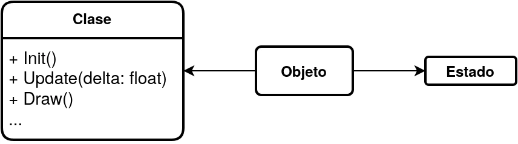
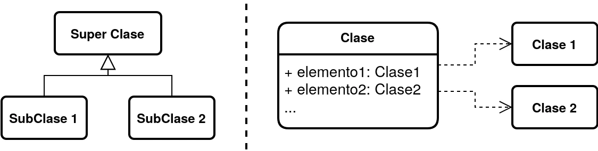

Buenas gente, para 2024 me he propuesto subir al menos una entrada cada mes en mi blog, ya sea un tutorial o alguna opinión mía, a ver que os parece. Quería haber subido esta entrada antes, pero estuve de mudanza de proveedor de dominio, ya que Google Domains cerraba (si, hije, si, otro servicio más), y quería mirar algún otro proveedor más barato.

En esta entrada hablaré de dos puntos clave a la hora de desarrollar en <a href="https://godotengine.org" target="_blank" rel="noopener">Godot</a>, uno de los principales motores de código abierto en estos momentos, que cuenta con una base de desarrolladores y contribuidores cada vez más grande, además de una comunidad bastante activa que nada tiene que envidiar a otros motores privativos como Unity o Unreal. Es por eso que creo que, ya seas principiante o, por el contrario, tengas un cierto conocimiento y experiencia previa, es fundamental que conozcas dos conceptos principalmente: La programación orientada a objetos por clases y la programación dirigida por eventos. Es verdad que otros motores tienen estos conceptos, y tampoco es algo nuevo que haya inventado Godot, pero, lo que me parece especial en este caso es que son características que vienen intrínsecas en la arquitectura del propio motor.

Con respecto a la programación orientada a objetos, no es un concepto sencillo a priori. En clases de programación te cuentan que un objeto se divide en un estado, que es lo que se almacena en memoria, y una serie de eventos o mensajes a los que podemos llamar para modificar su estado. Esta división existe porque el punto principal de la programación orientada a objeto es poder reutilizar el comportamiento de los elementos dentro del programa (por ejemplo cómo responder al hacer click en un botón, cómo reproducir una animación, la forma para detectar colisiones, …) de cosas que son concretas al elemento en si (el sprite que contiene la animación, el tamaño de la caja de colisiones o los colores de fondo del botón). Esta división es muy clara en los lenguajes de programación orientada a objetos por clases, como es el caso de GDScript, y es que la clase actúa como el contrato y especificación de los mensajes a los que podemos llamar (los métodos que hemos definido en la clase), y las instancias son punteros a espacios en la memoria del ordenador en donde se especifica el estado actual de un objeto dado (la forma del estado viene definido por los atributos y propiedades de la clase). Que conste que en los lenguajes de programación orientados a prototipos como pueden ser Lua o ECMAscript también existe esta diferencia, pero es más borrosa, pero no entraré en detalle en este momento porque quiero hablar del caso particular de Lua en otro momento.

<p class="responsive-content"><a href="definicion_objeto.webp"></a></p>
<p class="content-footer">Relación de los elementos de un objeto.</p>

Entonces, por una parte definición de las clases y por otra las instancias, pero necesitamos poder relacionar estos conceptos para, en el caso que nos atañe, compartir información y relacionarla de alguna forma para poder construir un videojuego. Con respecto a relacionar la información tenemos una herramienta que nos da la propia programación orientada a objetos por clases, que es la herencia. Y es que dada una clase, podemos hacer que esta incluya el comportamiento de una clase superior (lo que llamamos clase padre o superclase), y a su vez, crear nuevas clases que deriven de esta (las clases hijas o subclases). Con esto, podemos definir un comportamiento compartido entre clases en una superclase sin tener que reimplementarlo (o hacer un copy-paste) de cada vez. Ahora, con respecto a compartir la información hay una herramienta que nos permite simplificar de cierta forma la herencia, y es lo que se llama composición. Aquí lo que hacemos es que la clase tenga referencias directas a instancias de otras clases, y cuando tenemos que hacer algo, delegamos en los distintos métodos de las instancias a las que referenciamos. Y ahora podríamos pensar: ¿Cuándo usar uno u otro? De aquí hay mucha literatura de cómo hacerlo, pero, poniendo el caso de Godot, pues la respuesta es que ambos sistemas. El motor usa una aproximación mixta en la que el comportamiento de los objetos recaen en los Nodos, que son instancias de la clase <a href="https://docs.godotengine.org/en/stable/classes/class_node.html" target="_blank" rel="noopener">Node</a> o de una de sus subclases: tenemos desde <a href="https://docs.godotengine.org/en/stable/classes/class_node2d.html" target="_blank" rel="noopener">Node2D</a>, <a href="https://docs.godotengine.org/en/stable/classes/class_label.html" target="_blank" rel="noopener">Label</a>, <a href="https://docs.godotengine.org/en/stable/classes/class_animationplayer.html" target="_blank" rel="noopener">AnimationPlayers</a>, ¡y hasta <a href="https://docs.godotengine.org/en/stable/classes/class_timer.html" target="_blank" rel="noopener">Timers</a>! En Godot, si necesitamos un elemento que haga las mismas funciones que un botón, podemos heredar de la clase <a href="https://docs.godotengine.org/en/stable/classes/class_button.html" target="_blank" rel="noopener">Button</a> (o incluso de <a href="https://docs.godotengine.org/en/stable/classes/class_basebutton.html" target="_blank" rel="noopener">BaseButton</a>, que es una clase abstracta pensada ya para eso). Pero claro, ahora necesitamos hacer que nuestros nodos se puedan comunicar entre ellos, por lo que aquí entra en juego la composición. Un ejemplo son las escenas, en la que un nodo puede tener hijos siguiendo una estructura de árbol. No se hereda, si no que añadimos referencias dentro de una lista de hijos, y en la que derivamos parte del comportamiento. Un ejemplo lo podemos ver en un personaje 2D: Empezaríamos con un <a href="https://docs.godotengine.org/en/stable/classes/class_characterbody2d.html" target="_blank" rel="noopener">CharacterBody2D</a> (si, Godot ya incorpora un player controller como nodo), y asignarle como hijos un <a href="https://docs.godotengine.org/en/stable/classes/class_collisionshape2d.html" target="_blank" rel="noopener">CollisionShape2D</a>, un <a href="https://docs.godotengine.org/en/stable/classes/class_sprite2d.html" target="_blank" rel="noopener">Sprite2D</a> (o incluso un <a href="https://docs.godotengine.org/en/stable/classes/class_animatedsprite2d.html" target="_blank" rel="noopener">AnimatedSprite2D</a> si queremos animaciones, sin necesidad del <a target="_blank" href="https://docs.godotengine.org/en/stable/classes/class_animationplayer.html" rel="noopener">AnimationPlayer</a>), y listo. Ahora viene la parte más importante con respecto a esta forma de trabajar, y es que si queremos modificar el CharacterBody2D para meterle más movimientos a nuestro personaje (por ejemplo correr o un movimiento de dash), solo tenemos que extender de este nodo en concreto (que lo podemos hacer añadiéndole un script al nodo desde el editor, que en esencia es una extensión de esta clase). Tenéis más información tenéis este <a href="https://www.youtube.com/watch?v=74y6zWZfQKk" target="_blank" rel="noopener"><i class="fa-brands fa-youtube"></i> vídeo</a>.

<iframe class="responsive-content" width="100%" height="270px" src="https://www.youtube-nocookie.com/embed/74y6zWZfQKk?si=xmBKXU1T-G9vy8YO" title="YouTube video player" frameborder="0" allow="accelerometer; autoplay; clipboard-write; encrypted-media; gyroscope; picture-in-picture; web-share" allowfullscreen></iframe>

Pues haciendo un breve resumen, en Godot tenemos composición de nodos en las escenas, y herencia dentro de un nodo al añadirle un script, y con esto estaría todo… bueno, todo no, y es que queda un detalle a mayores. La programación orientada a objetos vino para arreglar muchos problemas de reutilización y división de código, pero, como en sus inicios era un concepto bastante abstracto, sin unas reglas definidas, hizo que muchos desarrolladores empezaran a hacer código insostenible (si, en vez de arreglar, empeoró las cosas). Todo esto viene a que mucha gente venía con el chip de la programación imperativa, donde cada instrucción se ejecuta línea a línea. Es verdad que muchos lenguajes imperativos incorporan formas de definir funciones, interfaces o incluso módulos, pero aún así poco se parece al alto desacoplamiento que hay en un código dividido en clases. Para ello, en 1994, un grupo de ingenieros de software, conocidos como “The Gang of Four”, publicaron un libro que recopila unas reglas y formas de diseño que permitieran a los desarrolladores hacer de forma sencilla un mejor código siguiendo sus recomendaciones. Este libro se llama “Patrones de diseño: elementos para un software object-oriented reusable”. Si, he dicho la frase secreta para entrar en un mundo oscuro de la programación, que son los patrones de diseño. Un ente que tanto a estudiantes de informática como a seniors con 30 años de experiencia en el sector se nos atraganta bastante.

<p class="responsive-content"><a href="herencia-vs-composicion.webp"></a></p>
<p class="content-footer">Herencia vs. Composición.</p>

No entraré en detalles, porque este no es un tutorial sobre patrones de diseño (si queréis ejemplos, tenéis el libro de <a href="https://gameprogrammingpatterns.com/" target="_blank" rel="noopener">Game Programming Patterns</a>, de Robert Nystrom), pero dos de los patrones que tenemos que tener claro en Godot es el patrón <a href="https://gameprogrammingpatterns.com/observer.html" target="_blank" rel="noopener">Observador</a> y el patrón <a href="https://refactoring.guru/design-patterns/chain-of-responsibility" target="_blank" rel="noopener">Cadena de responsabilidad</a>.El primer patrón se define con dos componentes: un sujeto o objeto observable (que contiene una lista de objetos a los que notificar de posibles cambios o eventos) y un observador (que puede recibir estas notificaciones o eventos). En el caso del segundo patrón tenemos lo contrario, un objeto que tiene que realizar un trabajo (emisor), y delega en otro componente llamado receptor o manejador, que a su vez puede delegar en un segundo componente hasta llegar a un componente que nos permite realizar el trabajo requerido. Teniendo esto claro podemos entrar en lo que se llama programación orientada a eventos, caracterizada por mecanismos en los que procesos envían y reciben eventos, los procesan y/o delegan en otros componentes para realizar acciones. Muchos lenguajes de programación lo implementan mediante los llamados events, delegates y demás, pero Godot tiene una solución muy elegante para implementar esto: las señales. Tenéis un <a href="https://www.youtube.com/watch?v=BXkJeEGZr4o" target="_blank" rel="noopener"><i class="fa-brands fa-youtube"></i> vídeo</a> en el que lo explica de forma sencilla, así que voy a centrarme en lo importante, y es que la idea principal de las señales es el poder desacoplar de forma sencilla el comportamiento de los nodos, delegando su trabajo en otros sin tener que conocerlos.

<iframe class="responsive-content" width="100%" height="270px" src="https://www.youtube-nocookie.com/embed/BXkJeEGZr4o?si=XUd7irztklN9N0_K" title="YouTube video player" frameborder="0" allow="accelerometer; autoplay; clipboard-write; encrypted-media; gyroscope; picture-in-picture; web-share" allowfullscreen></iframe>

Para explicarlo sigamos con el ejemplo de la escena de personaje. Supongamos que queremos detectar cuando el personaje colisionó con un obstáculo que puede hacerle daño. Podemos empezar a definir dos señales en el Player: `damaged` que se usará para notificar al Player de que ha sufrido daños, y `life_changed`, que recibe por parámetro la vida actual para notificar a los nodos que lo necesiten de que la vida del jugador ha cambiado. Para centralizar la información en el objeto, el Player contendrá su vida actual. Con esto podemos conectar la señal de `damaged` a una función que tiene el Player que sea `on_damaged`, y en la que podemos hacer que se reste una vida y emita la señal de `life_changed`. Bien, ¿y cómo comprobamos que el jugador ha sufrido daños? Pues haciendo que sea el otro objecto. Si, por ejemplo, este hereda de un <a target="_blank" href="https://docs.godotengine.org/en/stable/classes/class_area2d.html" rel="noopener">Area2D</a> tenemos la señal de `body_entered`, que podemos conectar a una función que sea `on_body_entered` dentro del obstáculo. Comprobando que si el objeto que colisiona tiene el nombre de "Player", podemos emitir su señal de `damaged`. Bien, ahora necesitamos que tanto nuestro HUD como nuestro GameManager reaccione al cambio de vida (ya sea para modificar el número de vidas en pantalla o comprobar si el jugador ha muerto para ir a la pantalla de fin de juego). En este paso podríamos referenciar a estos objetos con el jugador para leer su vida en todo momento, pero es que para eso tenemos la señal creada antes. Si conectamos a cada objeto a esta señal, podemos hacer eso sin tener que acoplarlos al objeto del jugador. Con todo esto podemos poner la pega de que tenemos un código con un flujo con más carga al estar saltando de un objeto al otro, ya que las señales no son gratis y generar un overhead al invocar todo, pero, dependiendo de cómo implementamos el código, podemos obtener una buena mejoras y es que en Godot podemos responder a todos los objetos de forma paralela. Además, con esto tenemos un código más desacoplado, en el que cada clase tiene definida su funcionalidad, y por ende, más mantenible. Por ejemplo, podemos añadir más objetos que hagan daño al jugador replicando el funcionamiento de la bala.

```gdscript
## player.gd
extends CharacterBody2D

signal damaged
signal life_changed(lifes)

var lifes = 0

func on_damaged(): # conectado con damaged
    lifes -= 1
    life_changed.emit(lifes)

...
```

```gdscript
## bullet.gd
extends Area2D

func on_body_entered(body): # conectado con body_entered
    if body.name == "Player":
        body.damaged.emit()

...
```

<p class="content-footer">Ejemplo de implementación de los scripts.</p>

Hay muchas cosas más de las que podría hablar en Godot, porque pese a su pequeño tamaño, en realidad es un motor con bastantes cosas y de la que no es fácil masterizar y aprenderlo en una sola entrada, pero pienso que para empezar los dos temas que he tratado (escenas y nodos, y señales) son la base que tenemos que tener claro desde la primera toma de contacto para poder dominar Godot. Con todo, el mejor consejo que os puedo decir es que revisad la documentación, que a cada día que pasa está mucho más completa, y sobre todo haced cosas y experimentad con el motor, porque con ensayo y error es como más se aprende. Dicho esto espero que os haya gustado este tipo de entradas, que tengo ya algunas ideas en mente.

¡Nos vemos en la próxima, saludos 😽!
