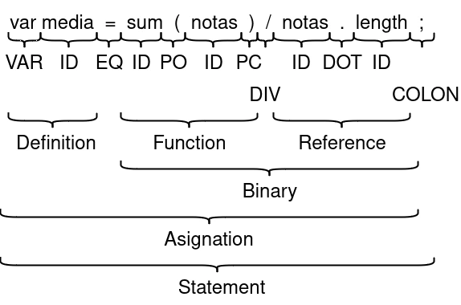

Antes de nada, sorry por estar ocupade. Mira que lo intento, porque la mitad ya la tenía escrita, pero al final tuve que publicarla a finales de marzo porque no me da la vida. En fin, en la [entrada anterior](../2024-02-29_que-es-un-lenguaje-de-programacion_i.md) empecé a describir cómo se crean los lenguajes de programación mediante los lenguajes formales, en concreto los lenguajes regulares y libres de contexto, que son los primeros niveles en la jerarquía de Chomsky. En el caso de los lenguajes regulares, nos permite obtener los patrones de caracteres al leer el texto, mientras que los lenguajes libres de contexto nos permite generar un autómata con pila que identifica los tokens de cada uno de los elementos disponibles en el código: Podemos tener tokens como `IDENTIFIER` para referirnos al nombre de una variable, `VALUE` para referirnos al valor de una variable, `COLON` o `PARENTHESIS` para referirnos a los símbolos `:` y `(`, o incluso para palabras reservadas del lenguaje como pueden ser `IF`, `ELSE`, `WHILE`, etc.

Bien, ¿Y con esto qué hacemos? Podríamos seguir escalando en la jerarquía de chomsky hasta llegar a un modelo que ejecute lo que hemos escrito, pero, si recordamos, el propósito general de un lenguaje de programación es no tener que escribir el código que va a ejecutar la máquina, es decir, abstraernos del código máquina. Sí que existen ciertos lenguajes que escalan más en esta jerarquía, pero lo veremos más adelante.

Volviendo al tema principal, una vez tenemos identificados los *tokens* del código fuente, necesitamos un mecanismo que analice las estructuras de nuestro lenguaje. Esto se realiza mediante un analizador sintáctico (parser en inglés), que crea lo que conocemos como árbol sintáctico (*AST* de *Abstract Syntax Tree* en inglés).

Algo parecido a un *AST* lo hacíamos de pequeñes en clase, ya que si recordamos las asignaturas de lengua, este árbol lo pintábamos cuando teníamos que analizar las oraciones. En ese caso nuestro árbol era un árbol sintáctico de una lengua natural, como puede ser el castellano, y con un *AST* representamos un lenguaje formal como puede ser un lenguaje de programación. Las diferencias más obvias entre una lengua natural y un lenguaje formal son que mientras en los primeros agrupamos por sujeto, predicado, complemento directo y demás estructuras del habla, en un lenguaje de programación agrupamos por sus estructuras lógicas, que puede ser la definición o asignación de variables, los bloque de flujo condicional o incluso definición de estructuras, como puede ser una clase o una interfaz.

<p class="responsive-content"><a href="ast.webp"></a></p>
<p class="content-footer">Ejemplo de árbol sintáctico para una asignación a una nueva variable.</p>

Con un *AST*, además de nuestra labor principal podemos construir herramientas que nos indican errores en nuestro código que son los correctores de errores (linters en inglés). Estos son muy usados por los entornos de desarrollo, como puede ser Visual Studio, JetBrains, y similares, y es que según vamos escribiendo nuestro código, se van ejecutando en paralelo.

Una vez tenemos una estructura bien formada en un *AST* de nuestro lenguaje, lo que se suele realizar es un recorrido de este árbol para, o ejecutarlo directamente, traducirlo en código fuente, o traducirlo a código máquina. En el primer caso hablamos de lenguajes de *scripting*, como puede ser Bash o las primeras implementaciones de ECMAScript (JavaScript para los amigos). En el segundo caso tenemos lo que se llama transpilación, y de aquí tenemos el ejemplo de TypeScript, un lenguaje que actúa como superconjunto de ECMAScript añadiendo una capa de tipado fuerte, entre otras cosas. En cambio, en el caso de traducirlo a código máquina pueden pasar dos cosas: que o lo traduzcamos a código de una máquina real o una virtual.

Esto último sucede porque hay lenguajes que contienen un nivel extra de abstracción. Recordemos que la idea al final es poder ejecutarse independientemente del hardware, pero claro en algún momento tenemos que ejecutarlo directamente en el procesador de nuestro dispositivo. Es por eso que en lenguajes como C tenemos un montón de compiladores dependiendo del hardware objetivo, e incluso varios compiladores para un mismo hardware (por ejemplo el compilador de Intel y el compilador open source de GCC para las arquitecturas x86 de Intel).

Otros lenguajes, en cambio, se traducen a un código máquina que no es soportado por ningún hardware real, si no que tenemos un software que emula un procesador, y ejecuta las instrucciones como si fuera un hardware real. Esto es lo que se llama una máquina virtual, y no deja de ser una máquina de Turing. Una máquina virtual lee lo que se considera un lenguaje recursivamente enumerable y es el tipo 0 en la jerarquía de Chomsky. Básicamente con un lenguaje recursivamente enumerable puedes construir cualquier lenguaje de programación existente, e incluso es el principio fundamental por el que podemos emular un hardware dentro de otro hardware. Las máquinas de Turing son las definiciones matemáticas de un ordenador, y puede darse el caso de que puedan contener incluso otra máquina. Si os interesa este campo, como curiosidad, existe una paradoja con esta definición que afecta a todas las matemáticas, tanto actuales como futuras. Para eso mirad el  <a rel="noopener" href="https://es.wikipedia.org/wiki/Problema_de_la_parada" target="_blank">problema de la parada</a>, el cual Alan Turing y Alonzo Church estudiaron indistintamente en lo que se conoce como <a rel="noopener" href="https://es.wikipedia.org/wiki/Tesis_de_Church-Turing" target="_blank">tesis Church-Turing</a>.

Vale, y aquí nos podemos preguntar: ¿y la ventaja de tener tanta abstracción? ¿No podemos hacer que todo se ejecute directamente en el procesador? Pues a ver, una de las ventajas de tener una máquina virtual es que no necesitamos depender de un hardware específico, pudiendo portar nuestro código entre distintas máquinas. Solo tenemos que hacer que nuestra máquina virtual se ejecute en un hardware real, y para eso podemos construirla en lenguajes como C. Además, los lenguajes que compilan a código máquina son mucho más óptimos y rápidos que los de scripting, ya que estos últimos, todas las tareas de las que hemos estado hablando se realizan al momento de ejecutar el código del script. Es por eso que muchos lenguajes de scripting, para ganar más rapidez en la ejecución, tienden a tener una máquina virtual. No da la misma optimización que un hardware real pero se le acerca bastante. Lenguajes que utilizan una máquina virtual son Lua, las versiones actuales de JavaScript o incluso lenguajes como C#.

Ahora que sabemos cómo se construye un lenguaje de programación, vamos a responder a la pregunta inicial: ¿por qué HTML y CSS son lenguajes de programación? Si recordamos, antes hablé que el objetivo último de un lenguaje de programación es abstraernos del código máquina en cuestión, pero para eso el lenguaje tiene que ser computable, es decir, que una máquina lo pueda leer y ejecutar.

Hay muchos ejemplos de lenguajes que podemos traducir a una máquina de Turing (llamamos Turing completo), pero que no son computables (es decir, que una vez aplicado el algoritmo a una máquina de Turing, esta se detiene). Un caso muy claro es lo que definimos como <a rel="noopener" href="https://es.wikipedia.org/wiki/C%C3%A1lculo_lambda" target="_blank">cálculo lambda</a>. Es otro sistema formal de representar un algoritmo (idéntico a lo que es un lenguaje recursivamente enumerable) solo que aquí nos basamos en los principios matemáticos de cálculo funcional y recursividad. Es decir, la idea principal del cálculo lambda es la de representar un algoritmo como la aplicación de distintas funciones matemáticas. Un ejemplo sería en Haskell el factorial de un número:

```
factorial n
  | n < 0     = error "no existe el factorial para enteros negativos"
  | n == 0    = 1
  | otherwise = n * factorial (n-1)
```

Vale, ¿y dónde está el problema de que no sea computable? En la actualidad, lenguajes como OCaml y F# implementan técnicas de cálculo simbólico y motores de inferencia en las etapas de parsing y/o análisis. Esto se usa porque son lenguajes de tipado fuerte, como puede ser C o Java, y la finalidad estas técnicas es la de asegurar el tipo de las funciones de la misma forma que hace un compilador. El problema radica en que el tipado fuerte en un lenguaje funcional (es como se conoce a un lenguaje que implementa cálculo lambda), es un subconjunto del cálculo lambda formal (como los lenguajes recursivos en el caso de los lenguajes recursivamente enumerables si recordamos de la entrada anterior). Esto se debe a que la definición de tipos en estos lenguajes, a diferencia de un lenguaje imperativo, se hace mediante el concepto de *metalenguaje*, que es un sistema descriptivo que no representa per se funciones computables, si no las restricciones que tienen que tener. Esto hace que no todo el código que esté bien escrito, es decir, que se pueda representar como cálculo lambda, se puede representar en un lenguaje lambda tipado.

Continuando con la pregunta, por otro lado tenemos lenguajes que sí son computables, pero no Turing completo. Y un ejemplo lo tenemos con SQL. Aquí, en vez del lenguaje imperativo de una máquina de Turing, o el lenguaje funcional del cálculo lambda, nos basamos en el concepto de <a rel="noopener" href="https://es.wikipedia.org/wiki/%C3%81lgebra_relacional" target="_blank">álgebra relacional</a>. La idea, en este caso, es la de tener varios conjunto de elementos y varias funciones que nos representa la relación entre elementos de un conjunto a otro. Además tenemos un conjunto de operaciones algebraicas (unión, intersección, agrupación, proyección, etc.) que podemos aplicar a las funciones de relación y que nos permiten obtener subconjuntos con los elementos de los conjuntos a los que se relaciona. SQL es un lenguaje declarativo, en el que indicamos las definiciones de estas operaciones algebraicas sobre las relaciones, que en este caso son las bases de datos. De por sí SQL no es un lenguaje turing completo, ya que un lenguaje algebraico no se puede leer por una máquina de Turing, pero sí que es computable porque los motores de bases de datos pueden interpretar este lenguaje y traducirlo a diferentes algoritmos.

Otro ejemplo sería el de HTML, que es un lenguaje de marcado descriptivo. La estructura del HTML se define como etiquetas del tipo `<tag>` `</tag>`. Estas marcas describen las restricciones de elementos que contiene un documento HTML, pero no como se representan los contenidos del mismo. Esto hace que un navegador pueda interpretar un documento de forma diferente a otro, ya que la idea del código HTML no es la de cómo se muestra, si no cómo es el documento. Con respecto a su ejecución, HTML es computable si, y sólo si, el documento está bien escrito (aunque luego los navegadores hagan sus trampitas). Para ello se implementan las mismas técnicas que un lenguaje de programación (parsing y análisis), solo que en vez de *AST*, lo que se construye es un *DOM* (*Document Object Model* en inglés), que también es un árbol abstracto pero que representa la estructura del documento. El *DOM*, en vez de leerse para traducir a código máquina, se recorre para renderizar cada uno de los elementos en la pantalla del navegador.

Por otro lado está CSS. Este es un lenguaje declarativo en el que indicamos las especificaciones del estilo gráfico de elementos del código HTML, y que es leído una vez generado el *DOM*. Para ello, de la misma forma que SQL, indicamos relaciones entre diferentes marcas, en este caso usando selectores. Un selector representa los nodos del DOM a los que afectará el estilo que apliquemos, pudiendo afectar a una relación de nodos incluso (por ejemplo mediante relaciones padre hijo del tipo `article > p`). En las últimas versiones hemos visto que se han añadido ciertas funcionalidades que lo pueden hacer turing completo: definición de variables, animaciones con bucles, recursividad e incluso la función `calc()`, que permite evaluar expresiones matemáticas.

Con esto vemos que no todos los lenguajes de programación sirven para crear programas per se, sino que, dependiendo del contexto, podemos abstraernos para definir procedimientos como de qué color pintamos un botón o cómo definimos la recuperación de datos. De hecho existen lenguajes que sí son Turing completos y computables, pero que, como son específicos de un dominio, no se pueden usar de forma general. De aquí tenemos MathLab o GDScript, el cual es un lenguaje embebido dentro del motor Godot. ¿Esto hace que dejen de ser lenguajes de programación? Al final aquí entra más el ego de los “True Developers” de sentirse superiores al resto, de demostrar que tienen más conocimientos o que su trabajo es más “pesado”. Es por eso que debemos alejarnos de ese tipo de ideas, porque al final de todo tenemos que ser humildes. Todo lenguaje de programación no es nada sin un procesador donde ejecutarse, una pantalla o dispositivo donde mostrarse. Da igual que sea HTML, C, Python o SQL, todo tiene su complejidad y dominar las tecnologías informáticas no es tarea fácil, así que menos lobos, caperucita.

### Bibliografía

Para parte de la explicación me he basado en el libro de <a rel="noopener" href="https://craftinginterpreters.com" target="_blank">Crafting Interpreters</a>, de <a rel="noopener" href="https://mastodon.social/@munificent" target="_blank"><i class="fa-brands fa-mastodon"></i> Robert Nystrom</a>. Es un libro que me ha encantado mucho porque te explica hasta con dibujitos como construir un compilador de un lenguaje interpretado, con maquina virtual incluida. Lo bueno es que todo el contenido está disponible gratuitamente en su web.
